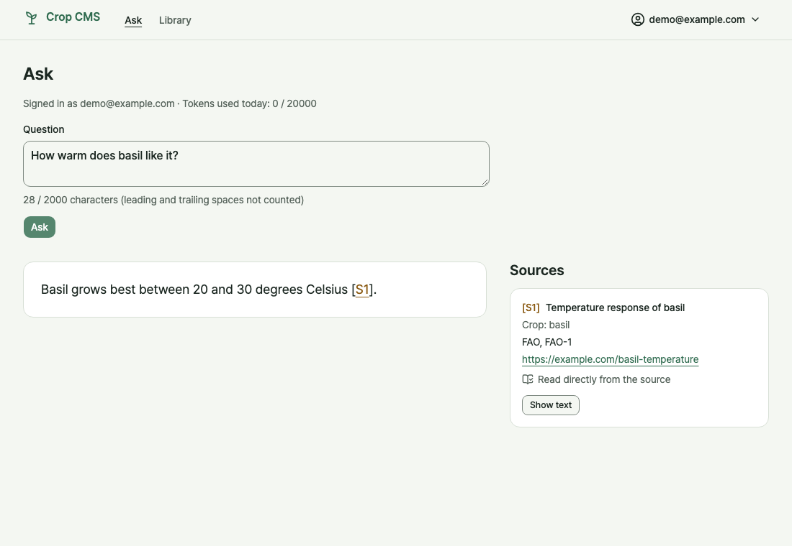
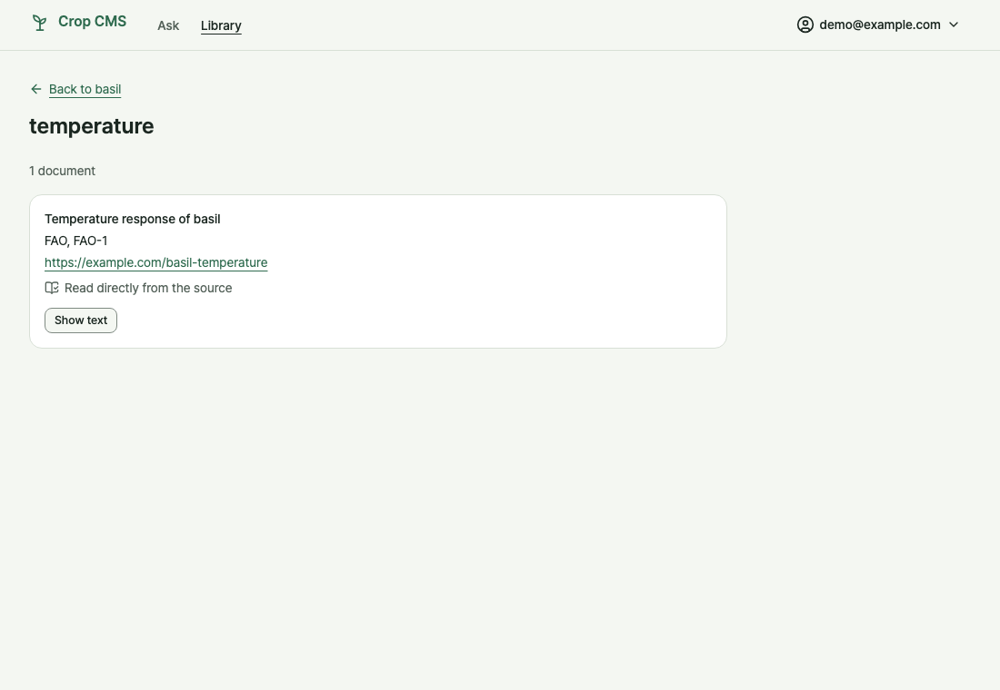
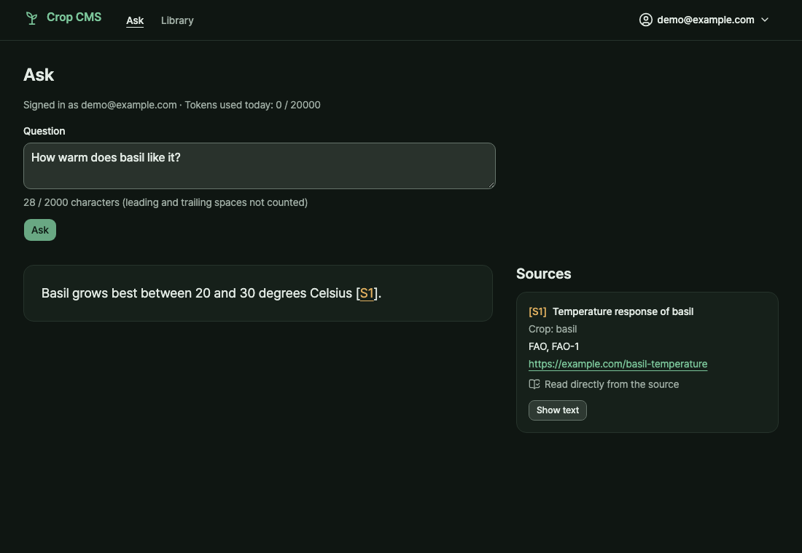
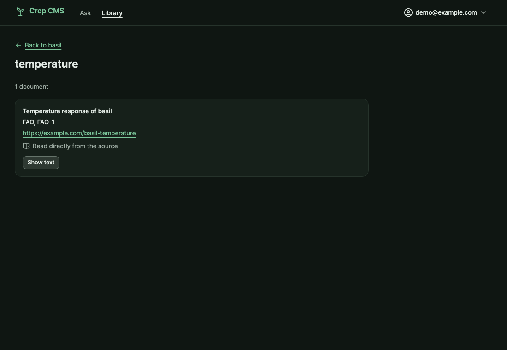

# Crop CMS Frontend

[](https://github.com/KyuHongCho/crop-cms-frontend/actions/workflows/ci.yml)

A React + TypeScript single-page app for the crop CMS backend: log in, sign up with an invite code,
ask crop questions and get cited answers.

Stack: React 19, TypeScript, Vite, Tailwind CSS 4 with shadcn/ui components (Radix), Pretendard
(self-hosted) and lucide icons. The design rules are in [`DESIGN.md`](DESIGN.md).

| Ask, with an answer and its sources | Library topic |
|---|---|
|  |  |
|  |  |

The screenshots come from the real app in Chromium with the end-to-end tests' mocked API (demo data,
no backend); see [Screenshots](#screenshots).

## Browser support

Tailwind CSS 4 needs Chrome 111, Safari 16.4 or Firefox 128 at minimum
([tailwindcss.com/docs/compatibility](https://tailwindcss.com/docs/compatibility)). The automated
end-to-end tests run in Chromium and WebKit (WebKit is close to Safari, not identical). The
maintainer also checked Safari by hand, without recording its version. Firefox is not tested.

In Safari the Tab key reaches links only with Option-Tab, or after turning on "Press Tab to highlight
each item on a webpage" in the Advanced pane of Safari settings; that is Safari's default, not a bug
in this app ([Apple's guide](https://support.apple.com/guide/safari/cpsh003)).

## Why it exists

[crop-cms-backend](https://github.com/KyuHongCho/crop-cms-backend) returns a topic's documents
**complete** and answers crop questions with citations. This app is the first consumer of that API,
and it makes those guarantees visible to a user:

- **Citations**, listed in the Sources panel beside the answer, show the source, reference and link,
  whether the document was read first-hand or through another source, the crop label, the condition
  and licence note when there are any, and the full text on request.
- **"No answer" is a state, not an error.** A declined question and a question with no relevant
  topic both show it, with the reason.
- **A "cut off" chip** appears when the response's `truncated` flag is set, and only then.
- **Dropped topics are named**, so a reader sees what was left out to fit the size limit.
- **The daily token budget message** says when the budget resets.
- **The Library** shows the same complete, published document set a chat answer draws on, by crop and
  topic, with the provenance of each document; drafts are never listed. A topic too large to return
  whole shows the server's refusal instead of a cut-down list.

The structured half of the planned chat, crop suitability from climate data, lives in
[crop-climate-advisor](https://github.com/KyuHongCho/crop-climate-advisor).

## Status

**Early and in progress.**

| Works today | Not built yet |
|---|---|
| Login and logout; the session is kept in `sessionStorage` for the tab, and an expired session returns to login with a notice | Admin screens (members, invites, unlock) |
| Invite-only signup, with browser checks that mirror the server's limits and an automatic login | Editing or deleting documents |
| `/chat` with every state above, plus `413` (topic too large), `503` (with a Retry button) and `422` | Deployment |
| The login page shows the lockout wait when the backend's throttle answers `429` (about 15 minutes for a fresh default lockout) | Conversation history: a server-side saved list of past answers is planned; today the backend answers single questions and nothing is saved |
| API types generated from the backend's OpenAPI, committed, with a drift check in CI | |
| CI (a required `checks` job) and an advisory AI review on pull requests | |
| Browser end-to-end tests in Chromium and WebKit (Playwright, API mocked), run by an advisory CI job | |
| A pre-commit hook (typecheck, then lint) | |
| A read-only Library at `/library`: crops, each crop's published topics with counts, and a topic's complete document set as source cards (login required in the UI; the API reads are public) | English / Korean interface (Korean text already renders in Pretendard; strings are kept as whole sentences for a later react-i18next pass) |
| An app shell and theme: a top bar with Ask / Library navigation and an account menu with a Light / Dark / System theme choice (follows the OS by default, remembered per browser), and per-page browser titles | |
| Each tab remembers its last page (Library returns to the topic you left); clicking the active tab goes to that section's home | |
| The app owns Back, Forward and reload scroll restoration: it turns the browser's own off and restores the position of each history entry once the page's content has loaded | |
| The Ask question and answer survive navigation within the session, including an answer that arrives after you left Ask; they are kept in memory and are lost on reload or logout | |

## Engineering highlights

- **Types come from the backend, and CI notices drift.** `src/api/schema.d.ts` is generated from the
  backend's OpenAPI and committed; a CI job regenerates it from the backend's main and reports a
  difference.
  [`src/api/schema.d.ts`](src/api/schema.d.ts) · [`scripts/check-api.mjs`](scripts/check-api.mjs) · [`.github/workflows/ci.yml`](.github/workflows/ci.yml) · [why](docs/design-notes.md#api-types-and-drift)
- **Every failure becomes one error shape.** The backend's `detail` is sometimes a string, sometimes
  a list and sometimes an object; one function turns each into the same `kind`, `status`,
  `message` and optional `retryAfter`.
  [`src/api/errors.ts`](src/api/errors.ts) · [`src/api/errors.test.ts`](src/api/errors.test.ts) · [why](docs/design-notes.md#error-shapes)
- **A 401 ends the session only if it answers the token still in use.** A late 401 for a token the
  user already replaced would otherwise log the new session out.
  [`src/api/client.ts`](src/api/client.ts) · [`src/pages/ChatPage.test.tsx`](src/pages/ChatPage.test.tsx) · [why](docs/design-notes.md#token-storage-and-sessions)
- **Model and document text is rendered as plain text.** There is no `dangerouslySetInnerHTML`, and
  a link is made only for `http(s)` addresses, with `rel="noopener noreferrer"`.
  [`src/components/answer/AnswerView.tsx`](src/components/answer/AnswerView.tsx) · [`src/components/answer/citeText.tsx`](src/components/answer/citeText.tsx) · [`src/components/sources/SourceCard.tsx`](src/components/sources/SourceCard.tsx) · [why](docs/design-notes.md#token-storage-and-sessions)
- **The question counter counts code points like the server, not UTF-16 units.** An emoji counts
  once, as it does on the server.
  [`src/pages/ChatPage.tsx`](src/pages/ChatPage.tsx) · [why](docs/design-notes.md#trade-offs-and-known-limits)
- **Design:** one calm sage palette in light and dark, with every colour pair measured. A test fails
  when `DESIGN.md`'s contrast table disagrees with the CSS, a pair falls below its floor, or a
  generated component brings back a low-contrast class.
  [`DESIGN.md`](DESIGN.md) · [`src/design/tokens.test.ts`](src/design/tokens.test.ts) · [`src/design/ui-classes.test.ts`](src/design/ui-classes.test.ts) · [why](docs/design-notes.md#design-system)
- **Tests fail on any unhandled network request.** A call with no mock fails the test that made it,
  even when the app swallows the error.
  [`src/test/setup.ts`](src/test/setup.ts) · [why](docs/design-notes.md#testing-details)
- **CI and the AI review mirror the backend's.** Same required check, same advisory review, with the
  review prompt adapted to this repo.
  [`.github/workflows/`](.github/workflows/) · [why](docs/design-notes.md#ci-and-the-ai-review)

Trade-offs, known limits and the full rationale: [`docs/design-notes.md`](docs/design-notes.md#trade-offs-and-known-limits).

## Quickstart

Requires Node 22.11 or newer (built and tested on 22.11.0; see [Dependency pins and Node](#dependency-pins-and-node)).

```bash
# 1. (backend checkout) Set up the backend by its Quickstart
#    (https://github.com/KyuHongCho/crop-cms-backend#quickstart). Its steps 1-3 are enough for
#    login and signup. The Library and chat also need the seeded demo corpus (below); without it
#    the Library shows no crops.
#      .env with the passwords and SECRET_KEY, then
docker compose up -d --build
docker compose exec cms alembic upgrade head
#    Chat answers also need the demo corpus (its step 4) and embeddings (its step 5, which needs
#    OPENAI_API_KEY), plus ANTHROPIC_API_KEY to answer. Without the corpus chat answers
#    "no relevant topics".
docker compose exec cms python -m scripts.seed
docker compose exec cms python -m scripts.reindex
#    The API listens on 127.0.0.1:8000.

# 2. (frontend checkout) Install; this also enables the pre-commit hook
npm install

# 3. (backend checkout) Mint an invite (shown once); the seed creates no members
CODE=$(docker compose exec -T cms python -m scripts.make_invite)
echo "$CODE"

# 4. (any directory) Optional: sign up with curl instead of the signup page, using the same $CODE.
#    Choose your own password (8-128 characters); do not reuse a real one.
curl -X POST localhost:8000/members/signup -H 'content-type: application/json' \
  -d "{\"email\":\"you@example.com\",\"password\":\"<your-chosen-password>\",\"invite_code\":\"$CODE\"}"

# 5. (frontend checkout) Start the dev server last: it keeps running. Open
#    http://localhost:5173/signup and paste the code (or /login if you signed up with curl).
#    The browser calls /api/*; the Vite dev proxy strips /api and forwards it to VITE_API_TARGET
#    (default http://127.0.0.1:8000). The proxy is dev-only.
#    Only if the backend is elsewhere: cp .env.example .env and edit VITE_API_TARGET. Vite reads
#    .env, not .env.example; restart npm run dev after changing it.
npm run dev
```

Then log in with the email and password you chose.

## Testing

```bash
npm test             # Vitest + React Testing Library + MSW
npm run typecheck    # tsc --noEmit
npm run lint         # ESLint
npm run build        # typecheck, then the production build
npm run e2e          # Playwright in Chromium and WebKit
```

The tests run fully offline: MSW mocks the API with responses typed from the generated schema, so
they need no backend and no API key. A request with no mock fails the test that made it
([why](docs/design-notes.md#testing-details)).

`npm run check:api` regenerates the types and fails if they differ from the committed file. It needs
the backend running, or `OPENAPI_SRC` pointing at another URL or a local OpenAPI file.

`.githooks/pre-commit` runs `npm run typecheck` then `npm run lint` on every commit. `npm install`
enables it (the `prepare` script sets `core.hooksPath`; run `npm run prepare` to do it by hand).
`git commit --no-verify` skips it. Tests are not part of it: run `npm test` yourself.

`npm run e2e` starts the Vite dev server on port 5199 (not 5173, so a running `npm run dev` is left
alone) and drives the real app in Chromium and WebKit. Playwright intercepts every `/api` request, so
there is no backend and no API key, and a request with no mock fails the test. The first run needs
the browsers: `npx playwright install chromium webkit` (on Linux add `--with-deps`). WebKit is close
to Safari, not identical. The tests check what jsdom cannot: that every signed-in route renders,
including when `window.scrollTo` returns a Promise, that the tabs work with real mouse clicks and
remember their last page, that Back, Forward and reload restore the scroll position, and that the Ask
answer is still there after visiting the Library. 46 tests pass (23 in each
browser). `typecheck` also covers `e2e/`.

What the offline tests cannot show, such as the real backend's answers, is checked by hand:
[`docs/manual-checks.md`](docs/manual-checks.md).

## Screenshots

`docs/images/` holds four PNGs (about 30-60 KB each). To regenerate them:

```bash
npx playwright test -c scripts/capture/playwright.config.ts
```

It starts its own dev server on port 5198, reuses the e2e mocks in `e2e/fixtures.ts` (no backend, no
API key) and writes `docs/images/ask-*.png` and `docs/images/library-*.png` in Chromium. It is not
part of `npm run e2e` or CI.

## Scripts

| Script | Does |
|---|---|
| `dev` / `build` | Vite dev server / typecheck + production build |
| `test` | Vitest + RTL + MSW, fully offline |
| `e2e` | Playwright in Chromium and WebKit, API mocked |
| `typecheck`, `lint` | `tsc --noEmit` for `src/` and for `e2e/` (`typecheck:e2e`), ESLint |
| `gen:api` | Regenerate `src/api/schema.d.ts` (committed) |
| `check:api` | Regenerate to a temp file and fail if it differs from the committed one |

`gen:api` and `check:api` read the live backend `http://127.0.0.1:8000/openapi.json` by default. Set
`OPENAPI_SRC` to another URL or a local OpenAPI file path to use that instead. Neither is part of
`npm test`.

Generated types cover only the declared 200/201/204 success responses and 422; `src/api/errors.ts` hand-maps the
other statuses (400/401/413/429/503).

## Dependency pins and Node

- `typescript` is pinned `~5.9.3`: `openapi-typescript@7.13.0` peers `typescript ^5.x` and
  `typescript-eslint@8.71.1` peers `typescript >=4.8.4 <6.1.0`, so TypeScript 6.1+ is not allowed yet.
- `jsdom` is pinned `^26.1.0` (engines `node >=18`): `jsdom@27.1.0` needs Node
  `^20.19.0 || ^22.12.0 || >=24.0.0`, and this project was built on Node 22.11.0, which is below 22.12.
  Moving to Node 22.12+ lifts that constraint.
- `@tailwindcss/oxide` (Tailwind 4) needs Node `>= 20` and `shadcn@4.21.4` needs Node `>=20.18.1`
  (npm metadata). Both were run on 22.11.0: `npm i -D tailwindcss @tailwindcss/vite`,
  `npx shadcn@4.21.4 init -t vite -b radix -p nova -y` and `npx shadcn@4.21.4 add input label textarea
  card badge alert dropdown-menu separator skeleton -y`, then the full test, typecheck, lint and build
  run. npm treats `engines` as advisory, so it would not have stopped a lower Node.
- `shadcn` is a runtime dependency here, not a dev tool: `src/index.css` imports `shadcn/tailwind.css`.
  The generated components import `cn` from the `cn` package, not clsx and tailwind-merge, so two
  conflicting Tailwind classes on one element are not merged; the later one in the stylesheet wins.
- There is no `engines` field in `package.json`: the Node floor above is what was tested, not
  something every dependency enforces.

## CI

The `checks` job (install from the lockfile, typecheck, lint, tests, build) runs on pull requests to
main and on pushes to main. It is the required check on `main`: branch protection is strict, applies
to admins, and requires a pull request. It uses the Node version in `.nvmrc`, so CI tests that
version and no newer one.

`e2e` installs Chromium and WebKit and runs `npm run e2e`; on failure it uploads the report and
traces. It is advisory: it is not a required check, and it has not yet run on Linux.

`schema-drift` regenerates the API types from the backend's main and fails when the committed
`src/api/schema.d.ts` disagrees. It is advisory; fix it with `npm run gen:api` against the backend
and commit the result.

An advisory AI review runs on pull requests and on a `/agentic-review` comment from the owner, a
member or a collaborator. It needs two things:

- the `CLAUDE_CODE_OAUTH_TOKEN` repository secret: without it the review stands down quietly;
- the [Claude GitHub App](https://github.com/apps/claude) installed on the repository: without it
  the review job fails with "Claude Code is not installed on this repository".

The labels `Review ongoing`, `Audit ongoing` and `Review finished` show its progress. Details:
[`docs/design-notes.md`](docs/design-notes.md#ci-and-the-ai-review).

## Related repositories

- [crop-cms-backend](https://github.com/KyuHongCho/crop-cms-backend) — the API this app talks to:
  the document store, members, and `POST /chat`.
- [crop-climate-advisor](https://github.com/KyuHongCho/crop-climate-advisor) — crop suitability from
  NASA POWER climate data and FAO ECOCROP requirements; the structured half of the planned chat.
- [agentic-workflow](https://github.com/KyuHongCho/agentic-workflow) — the plan → build → review
  workflow with adversarial auditors, used to build this repo; its review stage runs when a pull
  request is opened here.

## Licence

Source code: MIT — see [LICENSE](LICENSE). Crop data is not covered: it comes from the backend, and
each document carries its own licence note, which the app shows under the citation.

The Pretendard font, self-hosted from the `pretendard` npm package, is under the SIL Open Font
License 1.1.

Personal portfolio repository — issues are welcome; external pull requests are not accepted.
